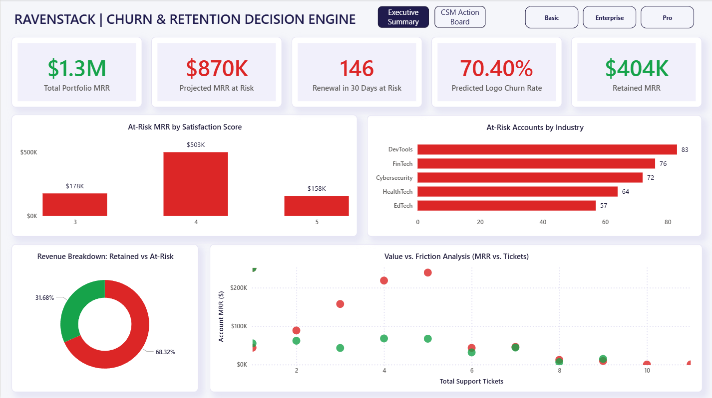
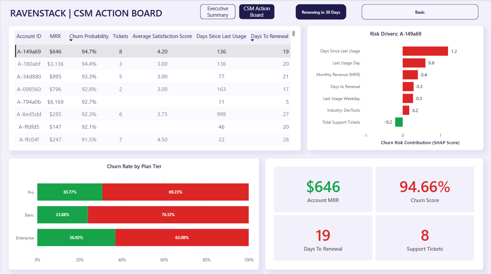

# RavenStack: Customer Churn & Retention Decision Engine

An end-to-end ML pipeline that identifies at-risk B2B SaaS accounts before they cancel — built on Google BigQuery, XGBoost, SHAP, and Power BI.



---

## The Business Problem

RavenStack wrapped up its pilot phase with ~500 accounts and had a churn problem. A significant portion of monthly subscribers were leaving, the Customer Success team had no early warning system, and the business had no way to know who to call, when, or why.

The goal wasn't just to model historical churn. It was to build something a CSM could open in the morning and act on — a ranked list of accounts renewing within 30 days, sorted by risk, with the specific behavioral reasons the model flagged each one.

---

## What This Builds

Two things, tightly connected:

**1. A machine learning pipeline** that ingests five normalized tables from BigQuery, engineers behavioral features (inactivity, support friction, satisfaction trends, days to renewal), trains an XGBoost classifier optimized for recall, and writes per-account SHAP explanations back to BigQuery.

**2. A Power BI decision engine** with two pages — an executive MRR summary for leadership, and a CSM Action Board where selecting an account dynamically updates a SHAP waterfall showing exactly what's driving that account's risk score.

The whole thing runs off live BigQuery connections. No static CSVs, no manual refresh.



---

## Pipeline

```
Five raw BigQuery tables
(accounts, subscriptions, feature_usage, support_tickets, churn_events)
        │
        ▼
SQL Feature Engineering (6 CTEs + Window Functions)
→ churn_feature_matrix view (500 accounts, 1 row each)
→ Includes: days_since_last_usage, days_to_renewal, renewal_urgency
        │
        ▼
Python: Preprocessing + XGBoost Training
→ Handles class imbalance via scale_pos_weight
→ Optimized for Recall (false negatives cost MRR)
        │
        ▼
SHAP Explainability (all 500 accounts)
→ Long-format export: top 7 features per account
        │
        ├─→ ravenstack_analytics.shap_explanations
        └─→ ravenstack_analytics.churn_scores
                │
                ▼
        Power BI Dashboard (live BigQuery connection)
        ├─ Page 1: Executive Summary
        └─ Page 2: CSM Action Board
```

---

## Key Results

- **64% recall** on baseline XGBoost — captures the majority of churners without threshold tuning
- **$870K in MRR** identified as at-risk across 341 flagged accounts
- **146 accounts** renewing within 30 days are flagged at-risk — the immediate intervention list
- **Days Since Last Usage** is the top churn predictor via SHAP, outweighing CSAT scores and ticket volume
- Counter-intuitive finding: accounts with CSAT scores of 4–5 still contributed **$503K in at-risk MRR** — satisfaction alone doesn't prevent churn when engagement drops

---

## Tech Stack

| Layer                 | Tools                                             |
| --------------------- | ------------------------------------------------- |
| Data Warehouse        | Google BigQuery                                   |
| Feature Engineering   | BigQuery Standard SQL (CTEs, Window Functions)    |
| ML & Explainability   | Python — XGBoost, SHAP, Scikit-learn, Pandas      |
| Business Intelligence | Microsoft Power BI (DAX, live BigQuery connector) |
| Version Control       | Git / GitHub                                      |

---

## Repository Structure

```
ravenstack-churn-engine/
│
├── docs/
│   ├── BRD.md
│   └── FINDINGS.md
│
├── sql/
│   ├── 01_base_architecture.sql
│   └── 02_feature_engineering.sql
│
├── notebooks/
│   ├── 01_churn_prediction_model.ipynb
│   ├── figures/
│   └── README.md
│
├── dashboard/
│   ├── RavenStack_Churn_Decision_Engine.pbix
│   ├── RavenStack_Light_Theme.json
│   ├── screenshots/
│   └── README.md
│
└── README.md
```

_Raw data CSVs and workbench files are gitignored._

---

## Design Decisions

**Why recall over accuracy?**
Missing a churner means losing their MRR with no warning. A false positive means a CSM sends an unnecessary check-in. The cost is asymmetric, so `scale_pos_weight` tilts the model accordingly.

**Why a global max date instead of CURRENT_DATE()?**
The dataset ends December 31, 2024. Using `CURRENT_DATE()` would make `days_since_last_usage` grow indefinitely, eventually making every account look maximally inactive. The global max date anchors calculations to the dataset's own timeline.

**Why long-format SHAP export?**
SHAP values come out of Python as a wide matrix. Power BI needs long format (one row per account per feature) to filter SHAP bars dynamically when a CSM clicks a row in the account table.

**Why only 30-day renewal urgency (not 60-day)?**
The data has two natural clusters: monthly subscribers renewing within 1–30 days, and annual subscribers renewing 184–365 days out. There's no organic 31–180 day cohort, so a 60-day tier would only add noise.

---

## Reproducing This Project

**Prerequisites:** Google Cloud project with BigQuery enabled, Python 3.9+, Power BI Desktop.

**Python packages:** `pandas`, `xgboost`, `shap`, `scikit-learn`, `google-cloud-bigquery`, `pandas-gbq`

1. Upload the five raw CSVs to a BigQuery dataset named `ravenstack_analytics`
2. Run `sql/02_feature_engineering.sql` to create the `churn_feature_matrix` view
3. Open `notebooks/01_churn_prediction_model.ipynb`, set your `project_id`, run all cells
4. Open the `.pbix` file, update BigQuery credentials, apply the light theme JSON, refresh

---

## Data Source

[RavenStack Synthetic SaaS Dataset](https://www.kaggle.com/datasets/rivalytics/saas-subscription-and-churn-analytics-dataset) by River @ Rivalytics — fully synthetic, MIT-like license. Credit required for reuse.

---

**Chirag Suri** · [LinkedIn](https://linkedin.com/in/chirag-suri) · [Portfolio](https://chiragsuri.github.io/) · [GitHub](https://github.com/Chiragsuri)
