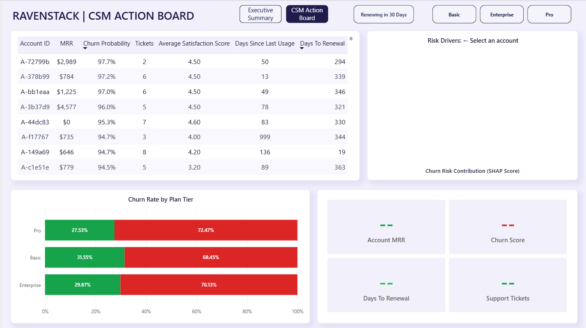

# /dashboard

The Power BI dashboard is the operational layer — it takes the BigQuery view and two Python-generated tables and turns them into something a CSM can actually use on a Monday morning.

Two pages. Different audiences. Different purposes.

---

## Page 1: Executive Summary

**Audience:** CRO, VP of Customer Success


Five KPI cards across the top:

| Card                        | Measure                                                                       | Color |
| --------------------------- | ----------------------------------------------------------------------------- | ----- |
| Total Portfolio MRR         | `[Active MRR] + [MRR at Risk]`                                                | Green |
| Projected MRR at Risk       | CALCULATE SUM where churn_label = At-Risk                                     | Red   |
| Renewals in 30 Days at Risk | COUNT where renewal_urgency = 'Renewing in 30 Days' AND churn_label = At-Risk | Red   |
| Predicted Logo Churn Rate   | Churned accounts / Total accounts                                             | Red   |
| Retained MRR                | CALCULATE SUM where churn_label = Retained                                    | Green |

Four charts below:

- **At-Risk MRR by Satisfaction Score** (column) — shows the counter-intuitive finding that CSAT 4–5 accounts contribute the most at-risk MRR
- **At-Risk Accounts by Industry** (horizontal bar, all red) — DevTools leads at 83 accounts
- **Revenue Breakdown: Retained vs At-Risk** (donut) — 31.68% / 68.32% split
- **Value vs. Friction Analysis** (scatter) — MRR on Y-axis, support tickets on X, red/green by churn_label

---

## Page 2: CSM Action Board

**Audience:** Customer Success Managers




**Top-left: At-Risk Account Table**
Filtered to `churn_label = At-Risk`, sorted by `churn_probability` descending.

Columns: Account ID, MRR, Churn Probability, Tickets, Average Satisfaction Score, Days Since Last Usage, Days To Renewal

Conditional formatting:

- `churn_probability`: red gradient background
- `days_since_last_usage`: red at high values
- `total_tickets`: red font above threshold

**Top-right: SHAP Risk Drivers (horizontal bar)**
Filters dynamically when a row is selected in the account table. Shows top 7 behavioral drivers for that account.

- Red bars = features pushing toward churn
- Green bars = features protecting against churn
- Title updates to "Risk Drivers: [Account ID]" via DAX measure
- Chart hides when no account is selected

**Bottom-left: Churn Rate by Plan Tier (100% stacked bar)**
Shows Pro/Basic/Enterprise churn split. Set to ignore the renewal urgency slicer via Edit Interactions.

**Bottom-right: Customer Snapshot (4 KPI cards)**
Activates on account selection:

- Account MRR
- Churn Score
- Days To Renewal
- Support Tickets

**Slicers:** Renewal Urgency (Renewing in 30 Days / Not Urgent) + Plan Tier

---

## Data Sources (all live BigQuery connections)

| Source                 | Type           | Purpose                                           |
| ---------------------- | -------------- | ------------------------------------------------- |
| `churn_feature_matrix` | BigQuery View  | Account features, MRR, churn labels, renewal data |
| `churn_scores`         | BigQuery Table | Model churn probability per account               |
| `shap_explanations`    | BigQuery Table | Top 7 SHAP features per account (long format)     |

**Relationships:**

- `churn_scores[account_id]` → `churn_feature_matrix[account_id]`
- `shap_explanations[account_id]` → `churn_feature_matrix[account_id]`

---

## Key DAX Measures

```dax
Total Portfolio MRR = [Active MRR] + [MRR at Risk]

Active MRR =
CALCULATE(SUM(churn_feature_matrix[mrr]), churn_feature_matrix[churn_label] = "Retained")

MRR at Risk =
CALCULATE(SUM(churn_feature_matrix[mrr]), churn_feature_matrix[churn_label] = "At-Risk")

Predicted Logo Churn Rate =
DIVIDE(
    CALCULATE(COUNTROWS(churn_feature_matrix), churn_feature_matrix[churn_label] = "At-Risk"),
    COUNTROWS(churn_feature_matrix), 0
)

Accounts Renewing in 30 Days at Risk =
CALCULATE(
    COUNTROWS(churn_feature_matrix),
    churn_feature_matrix[renewal_urgency] = "Renewing in 30 Days",
    churn_feature_matrix[churn_label] = "At-Risk"
)

SHAP Value Filtered =
IF(
    ISBLANK(SELECTEDVALUE(churn_feature_matrix[account_id])),
    BLANK(),
    SUM(shap_explanations[shap_value])
)

SHAP Chart Title =
"Risk Drivers: " & SELECTEDVALUE(churn_feature_matrix[account_id], "← Select an account")

Snapshot - MRR =
VAR sel = SELECTEDVALUE(churn_feature_matrix[account_id])
RETURN IF(ISBLANK(sel), BLANK(), SELECTEDVALUE(churn_feature_matrix[mrr]))

Snapshot - Churn Probability =
VAR sel = SELECTEDVALUE(churn_feature_matrix[account_id])
RETURN IF(ISBLANK(sel), BLANK(), SELECTEDVALUE(churn_scores[churn_probability]))
```

---

## Reproduction Steps

1. Open `RavenStack_Churn_Decision_Engine.pbix` in Power BI Desktop
2. **Home → Transform Data → Data Source Settings** — update BigQuery credentials
3. **View → Themes → Browse for themes** — apply `RavenStack_Light_Theme.json`
4. Refresh all data sources

The notebook must be run first so `shap_explanations` and `churn_scores` exist in BigQuery.

---

## Theme Files

- `RavenStack_Light_Theme.json` — lavender canvas, white cards, purple accent (applied)
- `RavenStack_Dark_Theme.json` — near-black canvas, dark navy cards (alternative)
