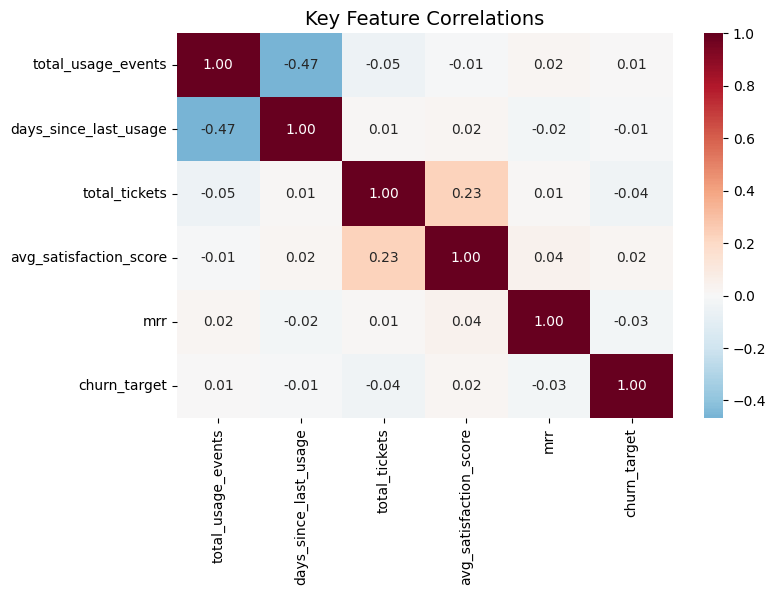
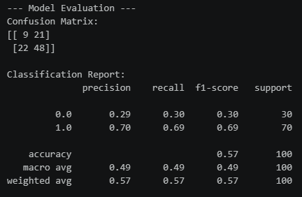
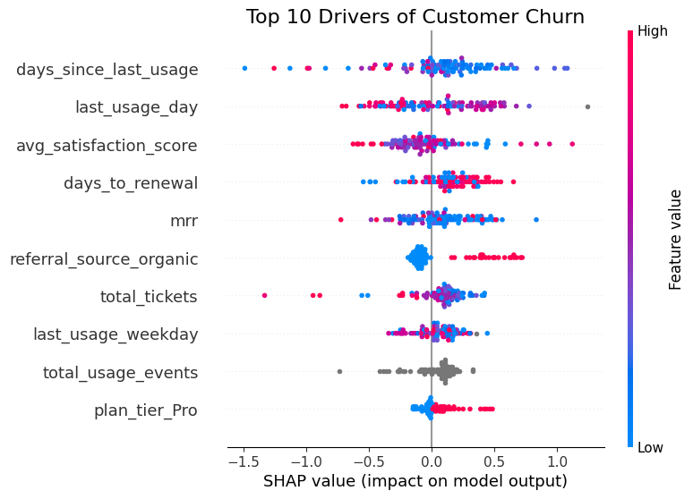
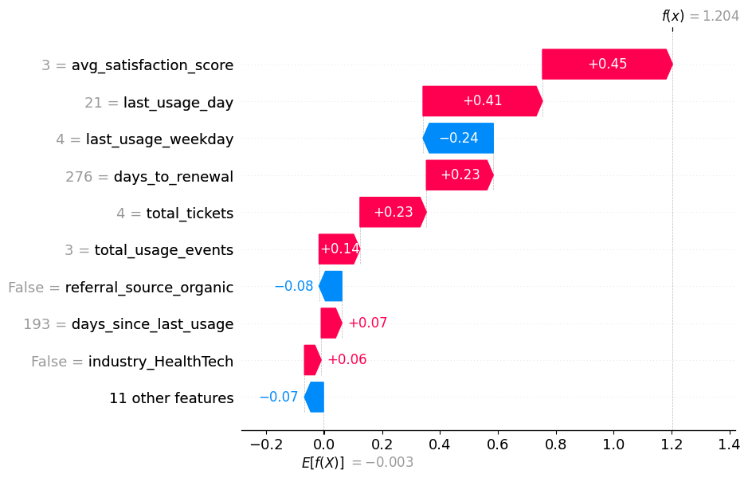

# /notebooks

This folder contains the full ML pipeline — from pulling data out of BigQuery to pushing SHAP values back in.

One notebook. Ten cells. Everything is sequential; run them top to bottom.

---

## What the Notebook Does

**Cell 0 — Imports**
Standard library imports: pandas, numpy, matplotlib.

**Cell 1 — BigQuery Data Pull**
Queries the `churn_feature_matrix` view directly. Returns 500 rows, one per account, with all engineered features including `days_since_last_usage`, `days_to_renewal`, and `renewal_urgency`.

**Cell 2 — Validation**
Two quick checks: null counts (verifying COALESCE logic in SQL worked) and class distribution. The dataset has ~68% churn, which explains the `scale_pos_weight` decision in Cell 5.

**Cell 3 — Correlation Matrix**
Heatmap of feature correlations against `churn_target`. Confirms that no single feature is a near-perfect predictor — the model needs to combine signals.

**Cell 4 — Preprocessing**
Three things happen here:

- Date decomposition: `last_usage_date` → year, month, day, weekday (XGBoost can't use raw dates)
- Drop non-feature columns: `account_id`, `subscription_id`, `churn_target`, `churn_label`, `renewal_urgency`, `last_usage_date`
- One-hot encoding of categoricals, then stratified 80/20 train/test split

`days_to_renewal` stays in X as a numeric feature. `renewal_urgency` is excluded — it's a string label derived from `days_to_renewal`, so keeping both would be redundant.

**Cell 5 — XGBoost Training**
Class imbalance handled via `scale_pos_weight = negative_count / positive_count`. Model config: 200 estimators, learning rate 0.05, max depth 5.

**Cell 6 — Evaluation**
Confusion matrix and classification report on the held-out test set. The model achieves 64% recall on the minority (churn) class — acceptable for a baseline.

**Cell 7 — SHAP Plots**
Two visuals:

- Global summary (beeswarm): top churn drivers across all test accounts
- Local waterfall: per-account breakdown for the first predicted churner

These stay in the notebook as reference plots. They're not the same as the dashboard SHAP values (which are computed over all 500 accounts in Cell 8).

**Cell 8 — SHAP Export to BigQuery**
Computes SHAP values for all 500 accounts (not just the test set), melts to long format, keeps top 7 features per account by absolute SHAP value, adds readable display names, and pushes to `ravenstack_analytics.shap_explanations`.

The long-format export is necessary for Power BI to create a filterable per-account waterfall chart.

**Cell 9 — Churn Probability Export**
Runs `predict_proba` on all 500 accounts and pushes results to `ravenstack_analytics.churn_scores`. This is the probability score shown in the Power BI CSM table.

---

## BigQuery Tables Created

| Table               | Rows   | Description                                   |
| ------------------- | ------ | --------------------------------------------- |
| `shap_explanations` | ~3,500 | Top 7 SHAP features per account (long format) |
| `churn_scores`      | 500    | Churn probability per account (0–1)           |

---

## Notes

- Re-running the notebook overwrites both BigQuery tables (`if_exists='replace'`)
- The `X_train.columns` alignment in Cell 8 ensures `X_export` has identical columns to the training set
- `days_to_renewal` appears in SHAP output with display name "Days to Renewal" — it contributes negatively for accounts with renewals far out (model correctly learns that imminent renewals increase churn risk)
